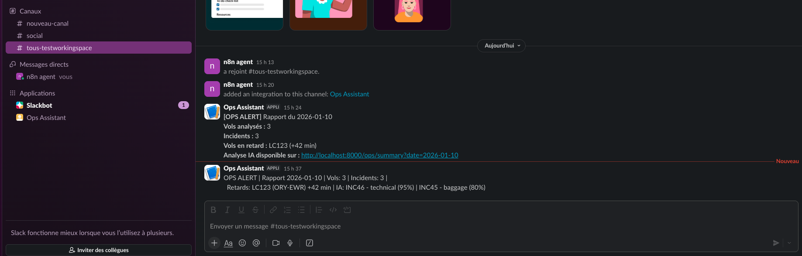
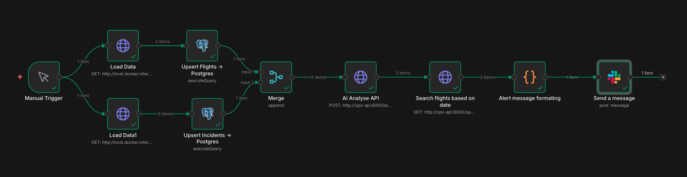

# Assistant Opérationnel Vols & Incidents

Pipeline automatisé de surveillance des vols, analyse IA des incidents, et alertes Slack.

## Architecture réelle (implémentée et testée)

```
data/flights.json   ──► HTTP Request (n8n) ──► Upsert Flights  ──► Postgres 
──► data/incidents.json ──► HTTP Request (n8n) ──► Upsert Incidents ──► Postgres
                                                                        │
                                                                        ▼
                                                          POST /ai/analyze (FastAPI)
                                                                        │
                                                                        ▼
                                                           Groq LLM (llama-3.3-70b)
                                                                        │
                                                                        ▼
                                                           Stockage ai_insights (Postgres)
                                                                        │
                                                                        ▼
                                                           GET /ops/summary (FastAPI)
                                                                        │
                                                                        ▼
                                                           Slack #ops-alerts
```

**Stack technique :** n8n · PostgreSQL · FastAPI (Python) · Groq LLM · Docker · Azure

---

## Structure du repo

```
.
├── schema.sql              # Schéma Postgres (3 tables + index)
├── queries.sql             # Requêtes SQL + justification des index
├── n8n_workflow.json       # Workflow n8n exporté
├── n8n_schema/
│   └── workflow_schema.md  # Schéma visuel du workflow + réponses aux questions
├── screenshots/
│   ├── n8n_workflow.png    # Capture du workflow n8n complet
│   └── slack_alert.png     # Capture de l'alerte reçue dans Slack
├── api/
│   ├── main.py             # Routes FastAPI (GET /ops/summary, POST /ai/analyze)
│   ├── db.py               # Connexion Postgres + requêtes
│   ├── ai_service.py       # Appel Groq LLM + validation JSON
│   ├── auth.py             # Vérification Bearer token
│   └── requirements.txt    # Dépendances Python
├── data/
│   ├── flights.json        # Données mock vols
│   └── incidents.json      # Données mock incidents
├── api.md                  # Description des endpoints API + sécurité
├── ai_logic.md             # Prompt LLM + logique règles métier + validation
├── azure_deployment.md     # Architecture Azure + Kubernetes + secrets
├── Dockerfile              # Image Docker de l'API (commentée)
├── docker-compose.yml      # Orchestre Postgres + API + n8n en local
├── .env.example            # Template des variables d'environnement
├── CHATGPT_LOG.md          # Journal d'utilisation de l'IA
└── README.md               # Ce fichier
```

---

## Démarrage rapide (local)

### Prérequis
- Docker Desktop installé
- Une clé API Groq (gratuite sur console.groq.com)

### 1. Configurer les variables d'environnement

```bash
cp .env.example .env
# Ouvre .env et remplis les valeurs :
# GROQ_API_KEY=gsk_...
# API_TOKENS=ton-token-secret
```

### 2. Lancer tous les services

```bash
docker compose up -d --build
```

Cela lance automatiquement :
- **ops-postgres** sur le port `5432` (avec le schéma SQL appliqué au démarrage)
- **ops-api** sur le port `8000`
- **ops-n8n** sur le port `5678`

Vérifie que tout tourne :
```bash
docker compose ps
```

### 3. Lancer le serveur de fichiers mock

Dans un terminal séparé (le laisser ouvert) :
```bash
python3 -m http.server 8080
```

Ce serveur expose `data/flights.json` et `data/incidents.json` à n8n via :
```
http://host.docker.internal:8080/data/flights.json
http://host.docker.internal:8080/data/incidents.json
```

### 4. Importer le workflow n8n

1. Ouvrir `http://localhost:5678` (login: `admin` / `admin123`)
2. Menu `...` → **Import from file** → sélectionner `n8n_workflow.json`
3. Configurer le credential **Postgres** dans n8n :
   - Host : `postgres`
   - Database : `opsdb`
   - User : `opsadmin`
   - Password : `opspassword123`
4. Configurer le credential **Slack** dans n8n :
   - Type : `Access Token`
   - Token : `xoxb-...` (Bot User OAuth Token depuis api.slack.com/apps)
   - Scopes requis : `chat:write`, `chat:write.public`
5. Cliquer **"Test workflow"**

### 5. Alerte Slack reçue



---

## Tester l'API directement

```bash
# Health check
curl http://localhost:8000/health

# Résumé opérationnel du jour
curl "http://localhost:8000/ops/summary?date=2026-01-10"

# Déclencher l'analyse IA pour un vol (remplace <token> par la valeur de API_TOKENS dans .env)
curl -X POST "http://localhost:8000/ai/analyze?flight_id=LC123" \
     -H "Authorization: Bearer <token>"
```

### Exemple de réponse — GET /ops/summary

```json
{
  "date": "2026-01-10",
  "total_flights": 3,
  "total_incidents": 3,
  "delayed_flights": [
    {
      "flight_id": "LC123",
      "route": "ORY-EWR",
      "delay_minutes": 42.0,
      "status": "departed"
    }
  ],
  "incidents_summary": [
    {
      "incident_id": "INC46",
      "flight_id": "LC123",
      "severity": 5,
      "normalized_category": "technical",
      "ops_summary": "Engine issue before departure"
    }
  ]
}
```

### Exemple de réponse — POST /ai/analyze

```json
{
  "flight_id": "LC123",
  "analyzed_incidents": [
    {
      "incident_id": "INC46",
      "normalized_category": "technical",
      "ops_summary": "Engine issue before departure",
      "recommended_action": "Inspect engine 2 immediately",
      "confidence_score": 0.95
    },
    {
      "incident_id": "INC45",
      "normalized_category": "baggage",
      "ops_summary": "Late baggage delivery",
      "recommended_action": "Improve baggage handling",
      "confidence_score": 0.80
    }
  ]
}
```

---

## Workflow n8n — nodes réels



| # | Node | Type | Rôle |
|---|---|---|---|
| 1 | Manual Trigger | `manualTrigger` | Déclenche le pipeline |
| 2 | HTTP Request (flights) | `httpRequest` GET | Charge flights.json depuis le serveur local |
| 3 | Upsert Flights | `postgres` Execute Query | INSERT ON CONFLICT DO UPDATE |
| 4 | HTTP Request (incidents) | `httpRequest` GET | Charge incidents.json depuis le serveur local |
| 5 | Upsert Incidents | `postgres` Execute Query | INSERT ON CONFLICT DO NOTHING |
| 6 | Call AI Analyze | `httpRequest` POST | POST /ai/analyze avec Bearer token |
| 7 | Get Summary | `httpRequest` GET | GET /ops/summary |
| 8 | Build Slack Message | `code` | Construit le message dynamique depuis les réponses API |
| 9 | Send a message | `slack` | Envoie via Bot Token (Access Token) sur #ops-alerts |

---

## Choix techniques clés

### LLM : Groq (llama-3.3-70b) plutôt que OpenAI

Groq offre une inférence ultra-rapide (~500 tokens/s) et une API gratuite.
Le modèle `llama-3.3-70b-versatile` est suffisamment puissant pour la
classification d'incidents en JSON structuré.

### Règles métier + fallback LLM

Pour un prototype sans dataset labellisé, les règles par mots-clés couvrent
70-80% des cas courants instantanément et gratuitement.
Le LLM prend le relais pour les cas ambigus. Voir `ai_logic.md`.

### Idempotence dans n8n

`ON CONFLICT DO NOTHING / DO UPDATE` garantit qu'on peut relancer le workflow
autant de fois qu'on veut sans créer de doublons en base.

### Requêtes SQL avec range plutôt que DATE()

Les requêtes filtrant par date utilisent un range sur `sched_dep_utc` au lieu
de `DATE(sched_dep_utc) = x`. L'appel de fonction `DATE()` empêche Postgres
d'utiliser l'index btree car il doit évaluer chaque ligne — c'est un full
table scan. Le range permet à Postgres d'utiliser `idx_flights_sched_dep_utc`
directement :

```sql
-- ❌ Full table scan — index inutilisé
WHERE DATE(sched_dep_utc) = '2026-01-10'

-- ✅ Index range scan — idx_flights_sched_dep_utc utilisé
WHERE sched_dep_utc >= '2026-01-10'::date
  AND sched_dep_utc <  '2026-01-10'::date + INTERVAL '1 day'
```

### Sécurité des tokens API

Le Bearer token n'est jamais codé en dur dans le code source. Il est chargé
depuis la variable d'environnement `API_TOKENS` au démarrage de l'API.
Si la variable est absente, l'API refuse de démarrer avec une erreur explicite.

### python:3.11-slim et non alpine

Alpine cause des problèmes de compilation avec `psycopg2` (musl vs glibc).
`slim` est le meilleur compromis taille/compatibilité.

### Chargement des fichiers JSON via HTTP

Le node n8n "Read/Write from Disk" retourne du binaire non parsé (métadonnées
uniquement). La solution retenue : serveur Python `http.server` exposant les
fichiers, consommés par un node HTTP Request qui parse automatiquement le JSON.

### 10 nodes au lieu des 4-6 suggérés

Le cahier des charges suggère 4-6 nodes comme guide de simplicité. Notre
workflow en compte 10 pour trois raisons architecturales justifiées :

**1. Séparation des responsabilités**

Chaque node fait une seule chose (principe de responsabilité unique) :
- Un node charge, un autre stocke, un autre analyse, un autre construit le message
- Si un node échoue, on identifie immédiatement lequel et pourquoi
- Un node unique "tout-en-un" serait plus difficile à déboguer et maintenir

**2. Séquentialité flights → incidents**

Le chargement est séquentiel : les vols sont insérés avant les incidents.
Cela garantit l'intégrité référentielle — un incident référence un `flight_id`
qui doit exister en base avant l'insertion.

**3. Séquentialité obligatoire AI → Summary**

`POST /ai/analyze` écrit dans `ai_insights`, `GET /ops/summary` lit depuis
`ai_insights`. Ces deux appels ne peuvent pas être fusionnés sans casser
la logique métier — ils restent donc deux nodes distincts.

**Conclusion** : le compte de nodes n'est pas un indicateur de qualité.
Un workflow bien structuré avec 9 nodes clairs est préférable à un workflow
opaque avec 5 nodes qui font trop de choses.

### Node Slack natif plutôt que Incoming Webhook

Le node Slack natif de n8n (`slack` v2.4) avec un Bot Token (`xoxb-...`) est
préféré à un HTTP Request vers un Incoming Webhook pour deux raisons :
- **Sécurité** : le token est stocké dans les credentials n8n chiffrés (AES-256),
  jamais exposé dans le JSON du workflow exporté
- **Fonctionnalités** : accès à l'API Slack complète (canaux dynamiques, threads,
  réactions) vs texte simple uniquement avec les webhooks

---

## Sécurité

- Aucun secret dans le repo (`.env` dans `.gitignore`)
- `API_TOKENS` chargé depuis l'environnement — l'API refuse de démarrer si absent
- `GROQ_API_KEY` injectée via variable d'environnement Docker
- Bot Token Slack stocké dans les credentials n8n chiffrés (AES-256)
- Conteneur API exécuté en utilisateur non-root
- En production : Azure Key Vault + Managed Identity

---

## Déploiement Azure (conceptuel)

| Composant | Service Azure |
|---|---|
| Postgres | Azure Database for PostgreSQL Flexible Server |
| API + n8n | Azure Kubernetes Service (AKS) |
| Images Docker | Azure Container Registry (ACR) |
| Secrets | Azure Key Vault |

Voir `azure_deployment.md` pour l'architecture complète et la stratégie de redéploiement.
